# DEVLA

### Smart Self-Driving Car for WRO Future Engineers

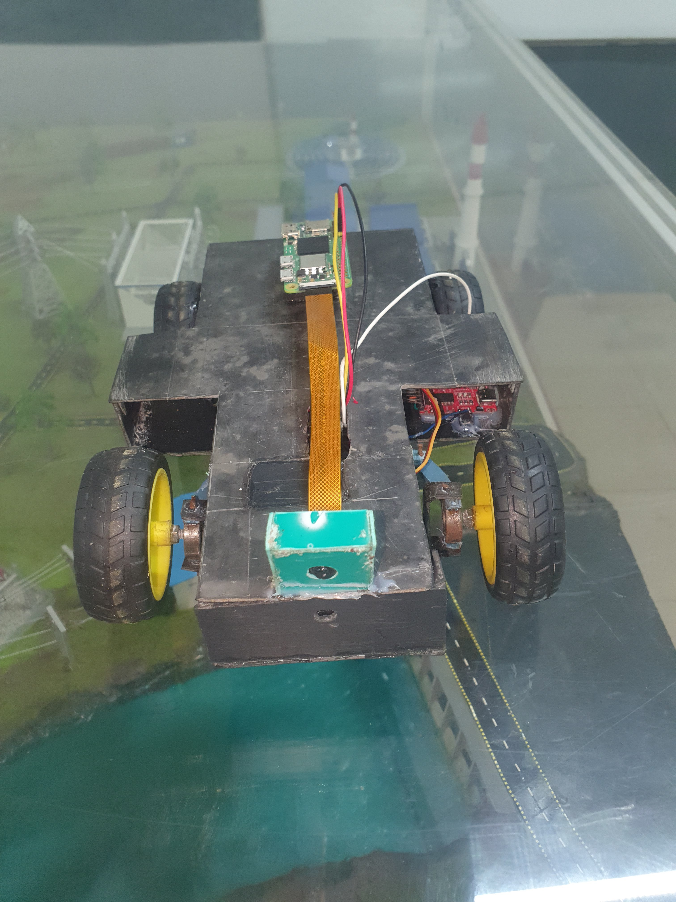

---

# Table of Contents

* Overview
* Team Introduction & Team Information
* Project Description
  * Hardware Architecture
  * Power Management System
  * Navigation and Control System
* Hardware Used
* Software & Libraries
* Competition Challenges
* Spoilers

---

# Overview

DEVLA is an autonomous self-driving vehicle developed for the World Robot Olympiad (WRO) Future Engineers category. The vehicle is designed to navigate a competition track without human intervention by combining computer vision, distance sensing, and real-time control systems.

The robot utilizes a hybrid architecture consisting of a Raspberry Pi Zero 2 W and an STM32 microcontroller. The Raspberry Pi performs high-level processing tasks such as image analysis, environmental perception, and navigation decision-making, while the STM32 manages real-time hardware operations including sensor acquisition, motor control, and steering actuation.

To achieve reliable autonomous navigation, DEVLA integrates multiple sensing technologies, including VL53L0X Time-of-Flight sensors for distance measurement, a BMI160 inertial measurement sensor for orientation tracking, a TCS34725 color sensor for color detection, and a Raspberry Pi Camera Module for visual perception. These sensors work together to provide accurate information about the vehicle's surroundings.

The navigation system is based on wall-following and closed-loop steering control principles. By continuously monitoring the distances to surrounding walls and obstacles, the vehicle maintains a stable position within the track while executing smooth turns and avoiding collisions.

The primary objective of DEVLA is to demonstrate the practical application of robotics, embedded systems, sensor fusion, and autonomous navigation technologies while achieving reliable performance in the WRO Future Engineers competition.

---

# Team Introduction & Team Information

## Team Name

KINGDOM TECH'S CONCEPT (KTC)

## Team Members

* Izahben Goodluck
* Nwankwo Goodness
* Olawoye Solomon
* Mosuid Yusuf

DEVLA is a collaborative robotics project developed by a team of students passionate about robotics, embedded systems, computer vision, and autonomous vehicle technology. Through the development of this vehicle, the team aims to apply engineering principles to solve real-world navigation challenges while gaining practical experience in robotics design and implementation.

---

# Project Description

## Hardware Architecture

DEVLA uses a distributed processing architecture that separates high-level intelligence from low-level vehicle control.

The system is built around two primary processing units:

### Raspberry Pi Zero 2 W

The Raspberry Pi Zero 2 W serves as the high-level processing unit of the vehicle. It is responsible for image processing, camera analysis, object recognition, and navigation decision-making.

### STM32 Microcontroller

The STM32 functions as the real-time control unit. It handles sensor acquisition, steering control, motor control, and communication with peripheral devices.

This separation allows both processors to focus on their specific tasks, improving reliability and overall system performance.

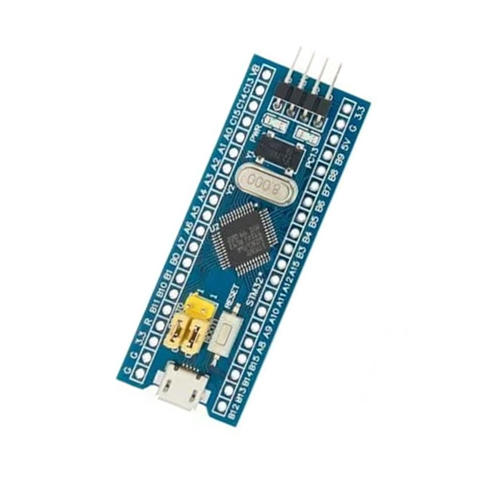

---

## Power Management System

Power management is a critical part of the DEVLA platform because the vehicle combines high-current drive components with sensitive electronic systems.

DEVLA is powered by a two-cell lithium-ion battery pack consisting of two 3.7V cells connected in series. This configuration provides a nominal voltage of 7.4V and a fully charged voltage of approximately 8.4V.

### High-Power Branch

The motor driver receives power directly from the battery pack. This allows the drive motor to access the full battery voltage required for acceleration, steering corrections, and obstacle avoidance maneuvers.

Providing direct battery power to the motor driver prevents unnecessary voltage losses and ensures consistent motor performance.

### Regulated Electronics Branch

A DC-DC buck converter is used to step down the battery voltage to a regulated 5V supply.

The regulated 5V line powers:

* Raspberry Pi Zero 2 W
* STM32 Microcontroller

The STM32 then provides a regulated 3.3V supply for low-voltage sensors and communication devices, including:

* VL53L0X Time-of-Flight Sensors
* BMI160 IMU
* TCS34725 Color Sensor
* PCA9548A Multiplexer

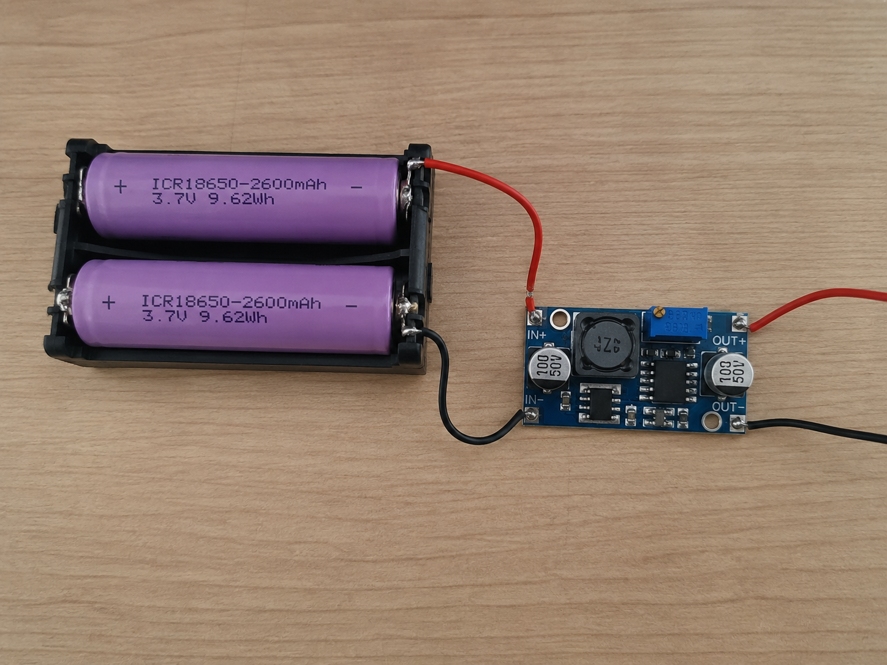

### System Stability

Separating the motor supply from the electronics supply reduces electrical noise and prevents voltage drops caused by sudden motor current demands.

This architecture improves:

* Sensor stability
* Communication reliability
* Raspberry Pi operation
* STM32 operation
* Overall vehicle performance

---

## Navigation and Control System

### Wall Following

DEVLA uses a wall-following algorithm to maintain a stable position within the track.

The system continuously measures the distance to the left and right walls using VL53L0X Time-of-Flight sensors. These measurements are used to determine whether the vehicle is centered within the lane.

The steering error is calculated as:

Error = Right Distance − Left Distance

* Positive error → steer left
* Negative error → steer right

The error is processed through a closed-loop controller that generates steering corrections, allowing the vehicle to maintain smooth and stable movement.

### Corner Navigation

A front-facing VL53L0X sensor continuously monitors the distance to walls ahead.

As the vehicle approaches a corner, the measured distance decreases. Once the distance falls below a predefined threshold, the navigation system transitions from wall-following mode to turning mode.

After completing the turn, the vehicle automatically returns to wall-following mode.

### Steering Controller

DEVLA employs a closed-loop steering control system.

The control cycle consists of:

1. Measure left and right wall distances.
2. Calculate steering error.
3. Generate steering correction.
4. Apply steering command.
5. Repeat continuously.

This feedback loop compensates for sensor noise, wheel slip, uneven surfaces, and steering inaccuracies.

### Autonomous Operation Workflow

1. Sensors monitor the environment.
2. Distance data is acquired.
3. Camera images are processed.
4. Navigation decisions are generated.
5. Commands are sent to the STM32.
6. Steering and motor outputs are executed.
7. The process repeats continuously.

---

# Hardware Used

### Raspberry Pi Zero 2 W
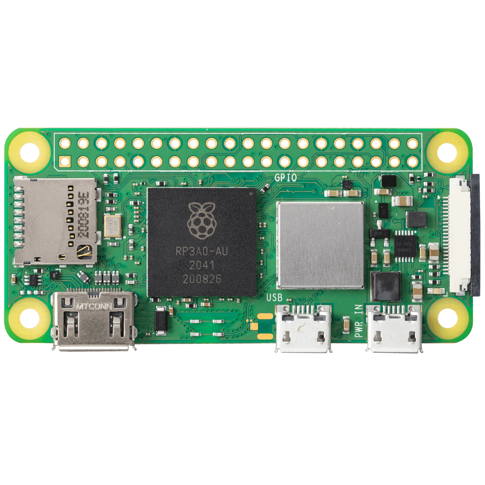

Why we chose the Raspberry Pi Zero 2 W:
> - **Compact form factor** suited to a small chassis
> - **Enough processing power** for image analysis and navigation logic
> - **Runs Python and OpenCV** for computer vision tasks
> - **Low power draw** relative to full-size single-board computers
> - **Reliable Wi-Fi connectivity** for remote debugging and code deployment

The Raspberry Pi Zero 2 W serves as the high-level processing unit responsible for image processing, object detection, and navigation decision-making.

 

### STM32 Microcontroller
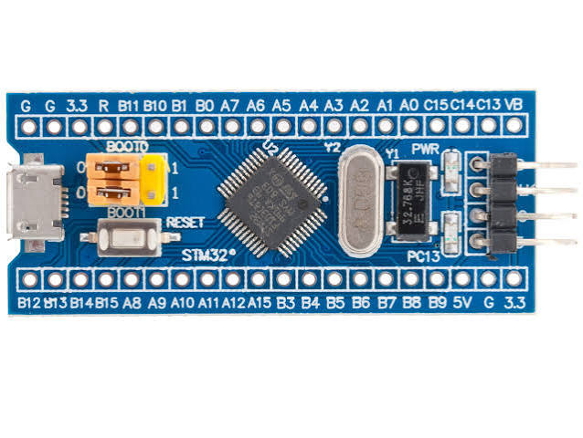

Why we chose the STM32:
> - **Real-time performance** for time-critical control tasks
> - **Dedicated hardware timers** for precise PWM generation
> - **Reliable I²C/UART communication** with sensors and the Raspberry Pi
> - **Efficient C++ execution** with minimal latency
> - **Proven stability** for embedded motor and steering control

The STM32 provides real-time control of sensors, steering, and motor systems. It was selected because of its speed, reliability, and precise hardware control capabilities.

 

### VL53L0X Time-of-Flight Sensors
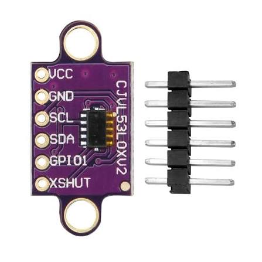

Why we chose the VL53L0X:
> - **Time-of-Flight accuracy**, more precise than conventional ultrasonic sensors
> - **Faster response times** for real-time wall following
> - **Compact I²C sensor** that's easy to multiplex across multiple units
> - **Reliable readings** for corner detection and obstacle avoidance
> - **Low interference**, unaffected by soft or angled surfaces the way ultrasonic can be

The VL53L0X sensors provide accurate distance measurements for wall following, corner detection, and obstacle detection. These sensors were selected because they offer greater precision and faster response times than conventional ultrasonic sensors.

 

### BMI160 Inertial Measurement Unit
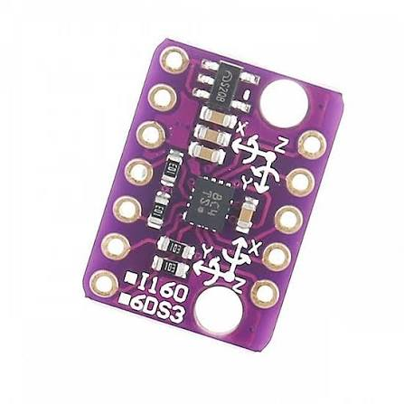

Why we chose the BMI160:
> - **Combined gyroscope and accelerometer** in a single compact package
> - **Orientation tracking** to help maintain steering stability
> - **Low power consumption**, ideal for a battery-powered vehicle
> - **I²C interface** for easy integration with existing sensor bus
> - **Fast data output** suited to real-time control loops

The BMI160 provides rotational and orientation data that helps maintain vehicle stability during navigation.

 

### TCS34725 Color Sensor
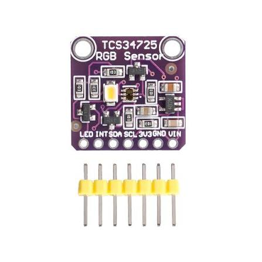

Why we chose the TCS34725:
> - **RGB color detection** for identifying track markers
> - **I²C interface** that integrates cleanly with our sensor bus
> - **Onboard IR filter** for more accurate color readings under varied lighting
> - **Compact size** that fits easily onto the chassis
> - **Fast sampling** suited to real-time marker detection

The TCS34725 is used to detect and identify colored markers within the competition environment.

 

### Raspberry Pi Camera Module
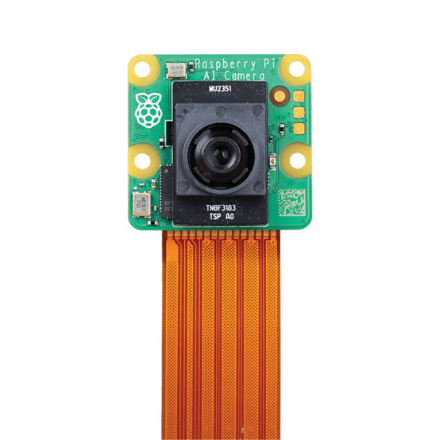

Why we chose the Pi Camera Module:
> - **Native compatibility** with the Raspberry Pi Zero 2 W
> - **Good enough resolution** for real-time image processing with OpenCV
> - **Low latency** video feed for navigation decisions
> - **Compact and lightweight**, easy to mount on the chassis
> - **Well-documented** with strong community/library support

The camera captures real-time images for visual analysis and navigation.

 

### SG90 Servo Motor
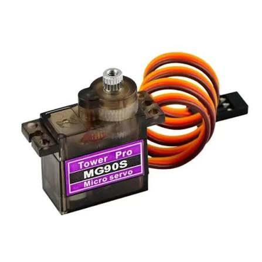

Why we chose the SG90:
> - **Lightweight and compact**, ideal for Ackermann steering setups
> - **Precise angular control** for accurate steering corrections
> - **Low cost and widely available**, easy to replace if damaged
> - **Simple PWM control interface** compatible with the STM32
> - **Fast response time** for real-time steering adjustments

The SG90 servo controls the Ackermann steering mechanism and enables precise steering adjustments.

 

### MX1508 Motor Driver
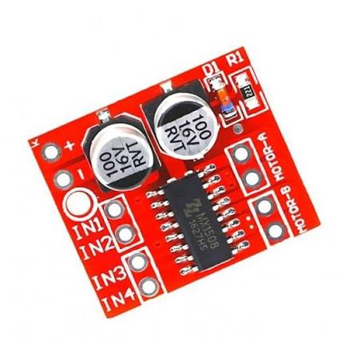

Why we chose the MX1508:
> - **Direct battery power handling** for consistent motor performance
> - **Simple control interface** from the STM32
> - **Reliable speed and direction control** for the drive motor
> - **Reasonable current handling** for our gear motor's demands
> - **Compact footprint** that fits within our power distribution layout

The motor driver regulates the speed and direction of the drive motor.

 

### TCA9548A I²C Multiplexer
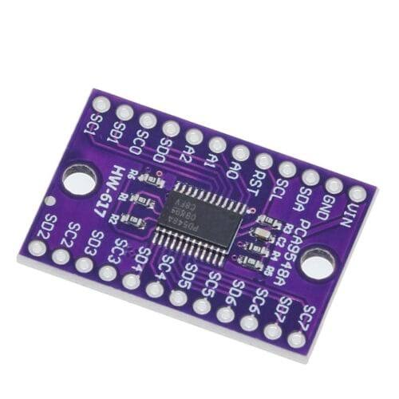

Why we chose the TCA9548A:
> - **Solves address conflicts** between multiple identical I²C sensors
> - **8-channel switching** gives room to expand sensors later
> - **Simple software control** for channel selection
> - **Stable I²C bus management** across all connected devices
> - **Compact and easy to integrate** into the existing wiring

The multiplexer enables multiple I²C devices with identical addresses to communicate on the same bus without conflicts.

 

### Gear Motor
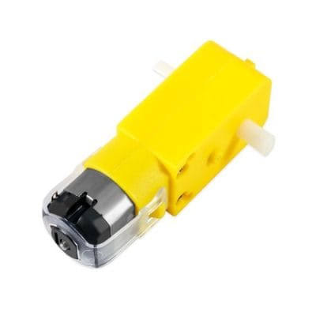

Why we chose the gear motor:
> - **Good balance of speed and torque** for track driving conditions
> - **Reliable propulsion** across varying surface conditions
> - **Compatible** with the MS5308 motor driver
> - **Durable construction** for repeated competition runs
> - **Straightforward mounting** onto the chassis drivetrain

The geared DC motor provides vehicle propulsion while maintaining a balance between speed and torque.

 

---

# Software & Libraries

## Visual Studio Code

Visual Studio Code is used for developing and managing Python-based software running on the Raspberry Pi.

## Arduino IDE

Arduino IDE is used to develop and upload firmware to the STM32 microcontroller.

## C++

C++ is used for embedded programming on the STM32 because of its efficiency and real-time performance.

## Python

Python is used for high-level processing, computer vision, and navigation logic on the Raspberry Pi.

## OpenCV

OpenCV is the primary computer vision library used for image processing, object detection, and environmental analysis.

## Command Prompt (Administrator)

Command Prompt is used for software installation, device configuration, file management, and development-related tasks during system setup and testing.

---

# Competition Challenges

## Wall-Following Accuracy

During early testing, the vehicle occasionally drifted away from the center of the lane. Small sensor errors and delayed steering responses caused instability.

To solve this issue, the wall-following algorithm was refined and steering parameters were tuned to improve responsiveness.

As a result, the vehicle achieved smoother and more reliable navigation.

## Late Corner Detection

One of the most significant challenges involved detecting corners at the correct time.

During initial tests, the vehicle often detected corners too late. By the time the front sensor recognized the approaching wall, the vehicle had already traveled too far forward, making smooth turns difficult.

To solve this issue, the corner-detection threshold was adjusted and multiple test runs were conducted to determine the optimal turning distance.

This allowed the vehicle to begin turning earlier and navigate corners more consistently.

## Obstacle Avoidance Timing

During obstacle avoidance testing, the vehicle occasionally approached obstacles too closely before initiating an avoidance maneuver.

Detection parameters were optimized and safe response distances were determined through repeated testing.

These improvements increased the available reaction time and improved obstacle avoidance performance.

## Power Stability

The drive motor generated current spikes during acceleration and steering maneuvers.

To prevent voltage fluctuations from affecting the electronics, the power system was separated into dedicated motor and regulated electronics branches.

This significantly improved system stability and reliability.

---

# Spoilers

## Future Improvements

Potential future upgrades include:

* Improved obstacle classification
* Enhanced steering control algorithms
* More advanced computer vision capabilities
* Adaptive navigation strategies
* Faster sensor processing
* Improved system optimization

## Engineering Philosophy

Throughout the development of DEVLA, the primary goal was to create a reliable, modular, and scalable autonomous vehicle. Every design decision was made with reliability, maintainability, and competition performance in mind.

The project demonstrates the integration of embedded systems, sensor fusion, control systems, and computer vision into a single autonomous platform capable of navigating complex environments with minimal human intervention.
